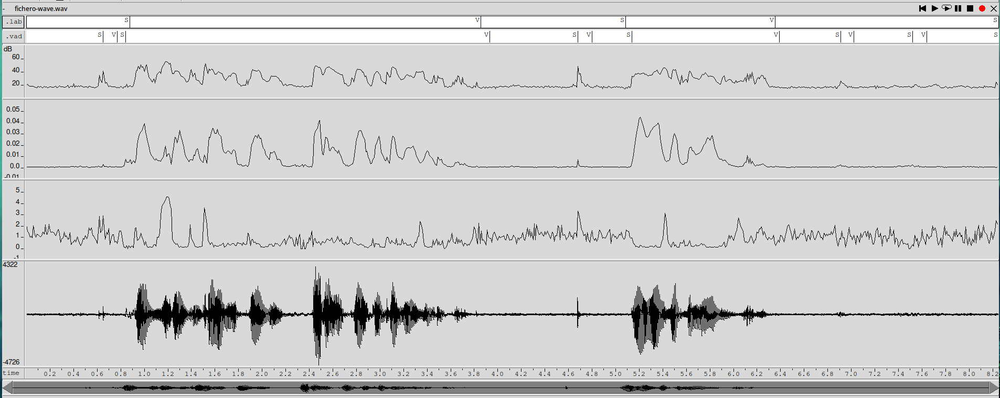
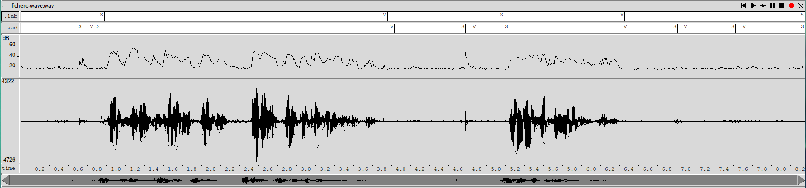
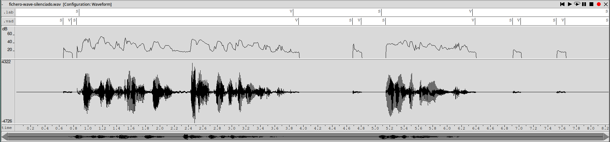
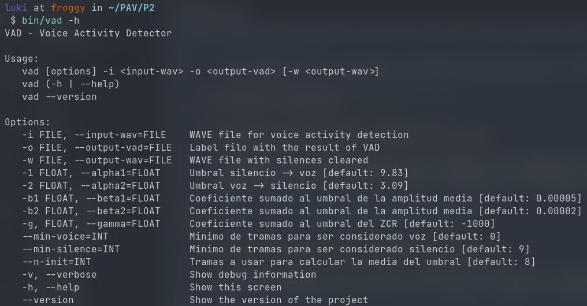

PAV - P2: detección de actividad vocal (VAD)
============================================

Esta práctica se distribuye a través del repositorio GitHub [Práctica 2](https://github.com/albino-pav/P2),
y una parte de su gestión se realizará mediante esta web de trabajo colaborativo.  Al contrario que Git,
GitHub se gestiona completamente desde un entorno gráfico bastante intuitivo. Además, está razonablemente
documentado, tanto internamente, mediante sus [Guías de GitHub](https://guides.github.com/), como
externamente, mediante infinidad de tutoriales, guías y vídeos disponibles gratuitamente en internet.


Inicialización del repositorio de la práctica.
----------------------------------------------

Para cargar los ficheros en su ordenador personal debe seguir los pasos siguientes:

*	Abra una cuenta GitHub para gestionar esta y el resto de prácticas del curso.
*	Cree un repositorio GitHub con el contenido inicial de la práctica (sólo debe hacerlo uno de los
	integrantes del grupo de laboratorio, cuya página GitHub actuará de repositorio central del grupo):
	-	Acceda la página de la [Práctica 2](https://github.com/albino-pav/P2).
	-	En la parte superior derecha encontrará el botón **`Fork`**. Apriételo y, después de unos segundos,
		se creará en su cuenta GitHub un proyecto con el mismo nombre (**P2**). Si ya tuviera uno con ese 
		nombre, se utilizará el nombre **P2-1**, y así sucesivamente.
*	Habilite al resto de miembros del grupo como *colaboradores* del proyecto; de este modo, podrán
	subir sus modificaciones al repositorio central:
	-	En la página principal del repositorio, en la pestaña **:gear:`Settings`**, escoja la opción 
		**Collaborators** y añada a su compañero de prácticas.
	-	Éste recibirá un email solicitándole confirmación. Una vez confirmado, tanto él como el
		propietario podrán gestionar el repositorio, por ejemplo: crear ramas en él o subir las
		modificaciones de su directorio local de trabajo al repositorio GitHub.
*	En la página principal del repositorio, localice el botón **Branch: master** y úselo para crear
	una rama nueva con los primeros apellidos de los integrantes del equipo de prácticas separados por
	guion (**fulano-mengano**).
*	Todos los miembros del grupo deben realizar su copia local en su ordenador personal.
	-	Copie la dirección de su copia del repositorio apretando en el botón **Clone or download**.
		Asegúrese de usar *Clone with HTTPS*.
	-	Abra una sesión de Bash en su ordenador personal y vaya al directorio **PAV**. Desde ahí, ejecute:

		```.sh
		git clone dirección-del-fork-de-la-práctica
		```

	-	Vaya al directorio de la práctica `cd P2`.
	-	Añada la etiqueta `origin` a su copia del repositorio. Esto es útil para facilitar los *push* y
		*pull* al repositorio original:
		```.sh
		git remote add origin dirección-del-fork-de-la-práctica
		```
	-	Cambie a la rama **fulano-mengano** con la orden:

		```.sh
		git checkout fulano-mengano
		```

*	A partir de este momento, todos los miembros del grupo de prácticas pueden trabajar en su directorio
	local del modo habitual.
	-	También puede utilizar el repositorio remoto como repositorio central para el trabajo colaborativo
		de los distintos miembros del grupo de prácticas; o puede serle útil usarlo como copia de
		seguridad.
	-	Cada vez que quiera subir sus cambios locales al repositorio GitHub deberá confirmar los
		cambios en su directorio local:

		```.sh
		git add .
		git commit -m "Mensaje del commit"
		```

		y, a continuación, subirlos con la orden:

		```.sh
		git push -u origin fulano-mengano
		```

*	Al final de la práctica, la rama **fulano-mengano** del repositorio GitHub servirá para remitir la
	práctica para su evaluación utilizando el mecanismo *pull request*.
	-	Vaya a la página principal de la copia del repositorio y asegúrese de estar en la rama
		**fulano-mengano**.
	-	Pulse en el botón **New pull request**, y siga las instrucciones de GitHub.


Entrega de la práctica.
-----------------------

Responda, en este mismo documento (README.md), los ejercicios indicados a continuación. Este documento es
un fichero de texto escrito con un formato denominado _**markdown**_. La principal característica de este
formato es que, manteniendo la legibilidad cuando se visualiza con herramientas en modo texto (`more`,
`less`, editores varios, ...), permite amplias posibilidades de visualización con formato en una amplia
gama de aplicaciones; muy notablemente, **GitHub**, **Doxygen** y **Facebook** (ciertamente, :eyes:).

En GitHub. cuando existe un fichero denominado README.md en el directorio raíz de un repositorio, se
interpreta y muestra al entrar en el repositorio.

Debe redactar las respuestas a los ejercicios usando Markdown. Puede encontrar información acerca de su
sintáxis en la página web [Sintaxis de Markdown](https://daringfireball.net/projects/markdown/syntax).
También puede consultar el documento adjunto [MARKDOWN.md](MARKDOWN.md), en el que se enumeran los
elementos más relevantes para completar la redacción de esta práctica.

Recuerde realizar el *pull request* una vez completada la práctica.

Ejercicios
----------

### Etiquetado manual de los segmentos de voz y silencio

- Etiquete manualmente los segmentos de voz y silencio del fichero grabado al efecto. Inserte, a 
  continuación, una captura de `wavesurfer` en la que se vea con claridad la señal temporal, el contorno de
  potencia y la tasa de cruces por cero, junto con el etiquetado manual de los segmentos.


En orden de arriba a abajo: etiquetado manual, etiquetado automático, potencia, amplitud media, ZCR y waveform.

- A la vista de la gráfica, indique qué valores considera adecuados para las magnitudes siguientes:

	* Incremento del nivel potencia en dB, respecto al nivel correspondiente al silencio inicial, para
	  estar seguros de que un segmento de señal se corresponde con voz.

	  Viendo la gráfica, creemos que la potencia para poder considerar que el segmento corresponde a voz se encuentra entorno a los 14 dBs tomando como referencia el ruido inicial.

	* Duración mínima razonable de los segmentos de voz y silencio.

	  La duración mínima del segmento de voz es de 0.5s y la duración mínima de los segmentos de silencio es de 1s.

	* ¿Es capaz de sacar alguna conclusión a partir de la evolución de la tasa de cruces por cero?

	  Lo primero que podemos ver es que se puede ver claramente cuando se producen señales fricativas. Por ejemplo, uno de los picos que se producen en el zcr ocurren al pronunciar el fonema /s. Además, hay una clara diferencia entre este pico y el valor que toma la gráfica cuando solo hay ruido/silencio.

### Desarrollo del detector de actividad vocal

- Complete el código de los ficheros de la práctica para implementar un detector de actividad vocal tan
  exacto como sea posible. Tome como objetivo la maximización de la puntuación-F `TOTAL`.

	Con tal de que el detector de actividad vocal funciona correctamente, hemos decidido tener en cuenta varios aspectos:

	1. La potencia media (en dBs) de las Ninit primeras tramas.
	2. La tasa de cruces por cero, zcr.
	3. Duración mínima de silencio, en nuestro programa *min_silence*
	4. Duración mínima de la voz, en nuestro programa *min_voice*
	5. Duración máxima de los estados *maybe voice* y *maybe silence*

	Todo esto se ha tenido en cuenta en la máquina de estados que hemos implementado para hacer funcionar el detector de voz. Inicialmente empezamos en un estado que hemos llamado **ST_INIT**, donde calculamos la potencia media de las Ninit tramas iniciales y definimos los umbrales que nos harán entrar en los 4 diferentes estados de nuestra máquina: **ST_SILENCE**, **ST_VOICE**, **ST_MAYBE_VOICE**, **ST_MAYBE_SILENCE**. 

	Dado que ya está todo el código a disposición, solo mostraremos el código que muestra cómo hemos calculado la potencia y cómo hemos definido la estructura del vad_data (muy importante en la máquina de estados) ya que es lo más importante para llegar a la decisión correcta:

	```c 
	case ST_INIT:
            if (vad_data->frame_counter < vad_data->n_init) {	//hacemos esto durante las Ninit primeras tramas de la señal
                vad_data->k0 += powf(10.0, f.p / 10) / vad_data->n_init;
                vad_data->zcr += f.zcr / vad_data->n_init;
                vad_data->frame_counter++;

            } else {
                vad_data->state = ST_SILENCE;
                vad_data->k0 = 10*log10f(vad_data->k0);
                vad_data->k1 = vad_data->k0 + vad_data->alpha1;
                vad_data->k2 = vad_data->k0 + vad_data->alpha2;
                vad_data->zcr += vad_data->gamma;
            }
            break;
	```
		
	A partir de aquí, en función de si supera o no los umbrales calculados iremos pasando de un estado a otro. Otro aspecto importante de nuestro programa es la definición de la estructura de `vad_data`, donde guardamos todos los parámetros importantes de nuestro VAD:

	```c
	typedef struct {
  	VAD_STATE state;
  	float sampling_rate;
  	unsigned int frame_length;
  	float last_feature; 	/* for debuggin purposes */
  	float k0;				//valor referencia, potencia media (dBs)
  	float k1;				//Primer umbral
  	float k2;				//Segundo umbral
  	float alpha1;
  	float alpha2;
  	float beta1;			//Estos parámetros no se ha utilizado finalmente (beta1 y beta2)
  	float beta2;			//Ya que se iban a utilizar mirando la amplitud media de la señal
  	float gamma;
  	int min_voice;
  	int min_silence;
  	int esperaS;
  	int esperaV;
  	unsigned int n_init;
  	unsigned int frame_counter;
  	float zcr;   			//tasa de cruces por cero que miraremos en el ruido
	} VAD_DATA;
	```

	Cabe destacar que parámetros como alfa1, alfa2, gamma, min_voice, min_silence y Ninit pueden pasarse como argumentos al programa


- Inserte una gráfica en la que se vea con claridad la señal temporal, el etiquetado manual y la detección
  automática conseguida para el fichero grabado al efecto.

  


- Explique, si existen. las discrepancias entre el etiquetado manual y la detección automática.

    Comparando se puede ver que la detección automática pone los cambios de estado donde toca,
    pero tambien pone algunos segmentos de voz en sitios donde no deberia. Estos etiquetados
    incorrectos corresponden a chasquidos de lengua o algun ruido del fondo.

- Evalúe los resultados sobre la base de datos `db.v4` con el script `vad_evaluation.pl` e inserte a 
  continuación las tasas de sensibilidad (*recall*) y precisión para el conjunto de la base de datos (sólo
  el resumen).

	A continuación evaluaremos la calidad de nuestro programa mediante el script vad_evaluation.pl. Ejecuándolo, obtenemos los siguientes resultados:

    ```
  	**************** Summary ****************
	Recall V:371.79/382.74 97.14%   Precision V:371.79/413.42 89.93%   F-score V (2)  : 95.61%
	Recall S:229.38/271.01 84.64%   Precision S:229.38/240.33 95.44%   F-score S (1/2): 93.07%
	===> TOTAL: 94.328%
    ```

	Como podemos ver, los resultados son bastante buenos dado que en un **`94.328 %`** de los casos se detecta correctamente cuando hay voz y silencio en una señal.

### Trabajos de ampliación

#### Cancelación del ruido en los segmentos de silencio

- Si ha desarrollado el algoritmo para la cancelación de los segmentos de silencio, inserte una gráfica en
  la que se vea con claridad la señal antes y después de la cancelación (puede que `wavesurfer` no sea la
  mejor opción para esto, ya que no es capaz de visualizar varias señales al mismo tiempo).

    
    

#### Gestión de las opciones del programa usando `docopt_c`

- Si ha usado `docopt_c` para realizar la gestión de las opciones y argumentos del programa `vad`, inserte
  una captura de pantalla en la que se vea el mensaje de ayuda del programa.

  


### Contribuciones adicionales y/o comentarios acerca de la práctica

- Indique a continuación si ha realizado algún tipo de aportación suplementaria (algoritmos de detección o 
  parámetros alternativos, etc.).

- Si lo desea, puede realizar también algún comentario acerca de la realización de la práctica que
  considere de interés de cara a su evaluación.

  Para encontrar las alfas óptimas hemos escrito un script de python
  ([get_simple_alphas.py](scripts/get_simple_alphas.py)), su funcionamiento es parecido al conjunto de
  comandos bash explicado en clase. Escoje un rango para alfa1 y alfa2, y encuentra el máximo, esto lo repite
  3 veces haciendo "zoom" cada vez. Va bastante bien y es relativamente rapido (unos 90 s en mi PC, 30s por
  iteración), a parte hay la opción de hacer un plot3D con los puntos calculados (me parecio divertido hacerlo
  :eyes:).

  Una vez teniamos las alfas era ir probando los demas valores hasta encontrar el máximo.

  Hay otro script de python para encontrar todos los parametros óptimos ([get_all_coefs.py](scripts/get_all_coefs.py)),
  en teoria tendria que funcionar pero tardaria mucho (horas). El funcionamiento es el mismo que con dos alfas pero con
  6 parametros en este caso, tarda demasiado para ser útil.

### Antes de entregar la práctica

Recuerde comprobar que el repositorio cuenta con los códigos correctos y en condiciones de ser 
correctamente compilados con la orden `meson bin; ninja -C bin`. El programa generado (`bin/vad`) será
el usado, sin más opciones, para realizar la evaluación *ciega* del sistema.
