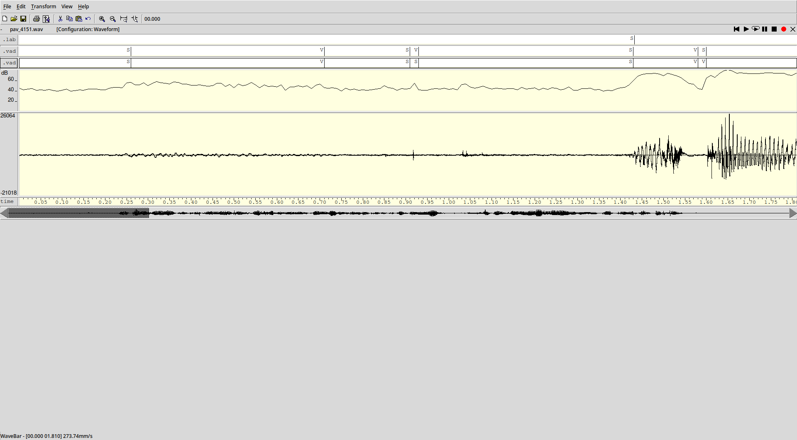

# TODO
Cosas que faltan por hacer o implementar, se puede añadir información del
estado actual.

- [X] **Eliminación de deltas:** si hay un gran periodo de voz y en medio se
        "detectan" pocas tramas (<50ms) de silencio, no contarlo como tal. Por
        el momento esto esta implementado, pero de la manera que esta hecho se
        escriben varios segmentos del mismo estado seguidos (S-S-S-V-...):
        
    
- [X] **Escribir en un fichero de salida:** En caso que se pase un fichero de
        salida escribir en el las tramas de voz y poner a 0 las tramas de
        silencio.

- [X] **Calculo de `vad_data->p1`:** Coger la media (lineal o dB), min, max, ?¿ de las
        primeras N tramas. Se tendria que mirar la función a aplicar a las N 
        muestras.

- [ ] **Titulo:** Mas cosas
